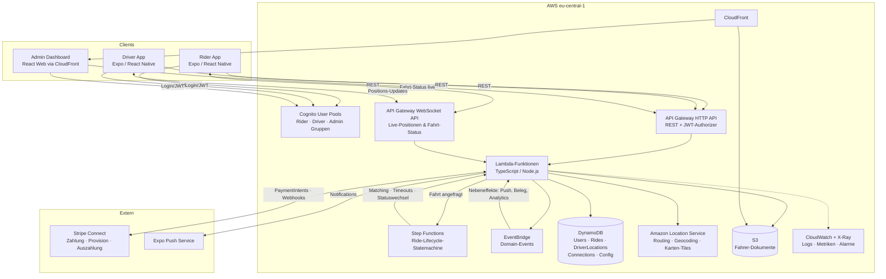

# Call-a-Ride – Feature- und Infrastrukturplanung

**Stand:** Juli 2026 · **Autor:** Planung mit Claude
**Rahmenbedingungen:** Solo-Entwickler (gute AWS-Kenntnisse) · Cloud-Budget < 100 €/Monat (MVP) ·
Marktplatz-Modell mit freien Fahrern · Zielmarkt Deutschland, Start in einer Stadt ·
React Native + Expo · TypeScript-Backend auf AWS Lambda · Amazon Location Service · Region `eu-central-1`

---

## Inhalt

1. [Feature-Planung](#1-feature-planung)
2. [AWS-Infrastruktur](#2-aws-infrastruktur)
3. [Tech-Stack & Projektstruktur](#3-tech-stack--projektstruktur)
4. [Roadmap](#4-roadmap)
5. [Top-5-Risiken & offene Fragen](#5-top-5-risiken--offene-fragen)

---

## 1. Feature-Planung

### 1.1 Fahrgast (Rider)

| Feature | Stufe | Anmerkung |
|---|---|---|
| Registrierung/Login (E-Mail + Telefonnummer-Verifizierung) | **MVP** | Telefonnummer ist Pflicht – Fahrer müssen Fahrgäste erreichen können |
| Social Login (Apple/Google) | V2 | Apple-Login ist App-Store-Pflicht, sobald andere Social Logins angeboten werden – deshalb erst mit V2 gebündelt |
| Abholort & Ziel setzen (Karte + Adresssuche) | **MVP** | Geocoding über Amazon Location Service |
| Preisschätzung vor Buchung | **MVP** | Festpreis-Anzeige schafft Vertrauen; Berechnung über Route (Distanz/Zeit) |
| Fahrt anfragen & Matching-Status sehen | **MVP** | Kern des Produkts |
| Fahrer-Position live verfolgen (Anfahrt + Fahrt) | **MVP** | Ohne Live-Tracking wirkt die App „tot" – Kernbestandteil der UX |
| Fahrt stornieren | **MVP** | Mit einfachen Regeln (kostenlos bis Zuweisung) |
| Bezahlung per Kreditkarte / Apple Pay / Google Pay | **MVP** | Über Stripe; Bargeld bewusst ausgeschlossen (vereinfacht Abrechnung & Sicherheit) |
| PayPal | V2 | In Deutschland stark nachgefragt, aber Stripe-Integration reicht für den Start |
| Fahrthistorie + Belege (PDF/E-Mail) | **MVP** | Beleg per E-Mail genügt im MVP; In-App-Historie einfach, da Daten vorhanden |
| Fahrer bewerten (Sterne + optionaler Kommentar) | **MVP** | Wichtig für Marktplatz-Qualität von Tag 1 |
| Fahrpreis teilen / mehrere Stopps | Später | Komplexität im Pricing, geringer MVP-Nutzen |
| Vorbestellung (Scheduled Rides) | V2 | Lokal sehr nützlich (z. B. Bahnhof/Flughafen), aber eigener Scheduling-Flow |
| Favoriten-Adressen (Zuhause/Arbeit) | V2 | Komfort, kein Blocker |
| SOS-Button / Fahrt teilen (Live-Link) | V2 | Sicherheitsfeature, wichtig für Vertrauen, aber nicht Launch-kritisch |
| Trinkgeld | V2 | Einfach über Stripe nachrüstbar |
| Fahrpreis-Splitting, Firmenkonten | Später | B2B erst nach Product-Market-Fit |

### 1.2 Fahrer (Driver)

| Feature | Stufe | Anmerkung |
|---|---|---|
| Registrierung + Dokumenten-Upload (Führerschein, **P-Schein**, Fahrzeugschein, Versicherung, Gewerbe-/Konzessionsnachweis) | **MVP** | In Deutschland rechtlich zwingend (PBefG): nur Fahrer mit Personenbeförderungsschein und Mietwagen-/Taxikonzession |
| Manuelle Verifizierung durch Admin | **MVP** | Bei lokalem Start mit wenigen Dutzend Fahrern ist manuelle Prüfung billiger und rechtssicherer als automatisierte KYC-Anbieter |
| Automatisierte Dokumentenprüfung (z. B. Stripe Identity) | Später | Erst bei Skalierung auf mehrere Städte sinnvoll |
| Online/Offline-Status („Fahrbereit") | **MVP** | Grundlage des Matchings |
| Fahrtanfrage empfangen, annehmen/ablehnen (Timeout) | **MVP** | Push + In-App-Dialog mit z. B. 15 s Annahmefenster |
| Navigation zum Fahrgast/Ziel | **MVP** | MVP: Deep-Link in Google/Apple Maps. Eigene Turn-by-Turn-Navigation ist enormer Aufwand für null Differenzierung |
| In-App-Navigation | Später | Nur falls Deep-Links in der Praxis stören |
| Verdienstübersicht (Tag/Woche) | **MVP** | Fahrer-Vertrauen: jederzeit sehen, was verdient wurde |
| Automatische Auszahlung (Stripe Connect) | **MVP** | Marktplatz-Kern: Plattform-Provision einbehalten, Rest automatisch auszahlen |
| Fahrgast kontaktieren (Anruf mit Nummern-Maskierung) | V2 | MVP: direkter Anruf; Maskierung (z. B. via Twilio Proxy) schützt Privatsphäre, kostet aber Integration |
| In-App-Chat | V2 | Anruf reicht im MVP |
| Fahrgast bewerten | **MVP** | Beidseitige Bewertungen halten den Marktplatz gesund |
| Heatmap / Nachfrage-Vorhersage | Später | Braucht Datenhistorie, die es am Anfang nicht gibt |
| Wochenabrechnung als PDF (für Steuer) | V2 | Fahrer sind Unternehmer und brauchen das mittelfristig zwingend |

### 1.3 Admin / Betreiber

| Feature | Stufe | Anmerkung |
|---|---|---|
| Fahrer-Verifizierungsqueue (Dokumente prüfen, freischalten/ablehnen) | **MVP** | Ohne das kann kein Fahrer legal fahren |
| Nutzer-/Fahrerverwaltung (sperren, Details einsehen) | **MVP** | Support-Grundfunktion |
| Live-Fahrtenübersicht (Karte + Liste) | **MVP** | Ops-Sicht: läuft das System? Wo klemmt es? |
| Preiskonfiguration (Grundpreis, €/km, €/min, Provision %) | **MVP** | Als Konfiguration, nicht hardcodiert – Preisexperimente sind beim lokalen Start sicher nötig |
| Surge Pricing | Später | Bewusste Entscheidung dagegen im MVP: rechtlich heikel (Preisangabenverordnung, Mietwagen-Preisbindung diskutiert), kundenfeindlich beim Marktaufbau, und ohne Nachfragedaten nicht kalibrierbar |
| Stornos & Erstattungen auslösen | **MVP** | Support-Alltag ab Tag 1 |
| Basis-Analytics (Fahrten/Tag, Umsatz, aktive Fahrer, Annahmequote) | **MVP** | Einfaches Dashboard reicht; kein BI-Stack |
| Promo-Codes / Gutschriften | V2 | Wichtiges Wachstums-Werkzeug kurz nach Launch |
| Support-Ticketing | Später | MVP: gemeinsames E-Mail-Postfach |
| Erweiterte Analytics (Kohorten, Funnels) | Später | Erst mit Datenvolumen sinnvoll |

---

## 2. AWS-Infrastruktur

### 2.1 Leitplanken

Bei < 100 €/Monat und einem Solo-Entwickler gilt: **konsequent serverless und pay-per-use, keine
dauerlaufenden Instanzen** (kein ECS-Service, kein ElastiCache, kein Aurora). Bei 100 Fahrten/Tag ist
jede „always-on"-Komponente das teuerste Element der Rechnung. Alles Folgende ist darauf optimiert –
mit klar benannten Umstiegspfaden für späteres Wachstum.

### 2.2 Entscheidungen im Überblick

| Baustein | Optionen | Empfehlung | Begründung |
|---|---|---|---|
| Auth | Cognito · Auth0 · selbstgebaut | **Cognito User Pools** | Pay-per-MAU (erste 10 000 MAU frei), SMS-OTP für Telefonverifizierung eingebaut, natives JWT für API Gateway. Auth0 ist teurer und ein zweiter Anbieter; selbstbauen ist Risiko ohne Nutzen |
| API | API GW HTTP API + Lambda · AppSync GraphQL · Fargate | **API Gateway (HTTP API) + Lambda** | HTTP API ist die günstigste Variante (~1 €/Mio. Requests), TypeScript-Lambdas sind gesetzt. AppSync/GraphQL lohnt sich erst mit mehreren Clients und komplexen Datengraphen; Fargate widerspricht Budget & Betriebsmodell |
| Echtzeit | API GW WebSockets · AppSync Events · IoT Core | **API Gateway WebSockets** | Pay-per-Message/Verbindungsminute, passt exakt zum Lambda-Stack (Connect/Disconnect/Message-Handler). AppSync Events wäre die Alternative mit weniger Eigenbau (Connection-Verwaltung), bindet aber an das AppSync-Modell; IoT Core ist für Geräteflotten gedacht und konzeptioneller Overkill |
| Geo/Karten | Amazon Location Service · Google Maps · Mapbox | **Amazon Location Service** (gesetzt) | Routing (ETA/Distanz), Geocoding/Places und Karten-Tiles (MapLibre-kompatibel) aus einer Hand, DSGVO-freundlich in `eu-central-1`, Preise weit unter Google. Karten-Rendering in Expo via `maplibre-react-native` |
| Fahrer-Matching | ElastiCache Redis GEO · DynamoDB + Geohash · Location Service Tracker | **DynamoDB + Geohash** | Redis GEO ist die Standard-Antwort, kostet aber ~25–50 €/Monat dauerhaft – bei 50 Fahrern absurd. Fahrer-Positionen als DynamoDB-Items mit Geohash-Präfix als Partition Key; Umkreissuche = wenige Query-Calls. Skaliert locker bis in die Tausende Fahrer. Umstieg auf Redis GEO erst, wenn Matching-Latenz real messbar leidet |
| Datenbank | DynamoDB · Aurora Serverless v2 · RDS | **DynamoDB (on-demand)** | Aurora Serverless v2 skaliert nicht auf 0 (min. ~0,5 ACU ≈ 45 €/Monat) und sprengt allein fast das Budget. Die Access Patterns (User by ID, Fahrten by User/Fahrer/Status, Fahrer by Geohash) sind gut bekannt und DynamoDB-tauglich. Analytics-Anforderungen später via Export nach S3 + Athena statt SQL-Betriebsdatenbank |
| Ride-Lifecycle | Step Functions · EventBridge + Lambdas · alles in einer Lambda | **Step Functions (Standard) + EventBridge** | Der Fahrt-Lebenszyklus (angefragt → Matching → zugewiesen → Anfahrt → unterwegs → beendet → abgerechnet) ist ein langlebiger Zustandsautomat mit Timeouts (z. B. „Fahrer antwortet nicht in 15 s → nächster Fahrer"). Genau dafür ist Step Functions gebaut; Timeouts/Retries selbst zu bauen ist fehleranfällig. EventBridge verteilt Statuswechsel an Nebeneffekte (Push, Belege, Analytics) |
| Zahlungen | Stripe Connect · Adyen · PayPal Braintree | **Stripe Connect (Destination Charges)** | Marktplatz-Standard: Fahrgast zahlt der Plattform, Provision wird einbehalten, Rest fließt an das Connect-Konto des Fahrers; Stripe übernimmt KYC/Auszahlungen der Fahrer. PCI-Scope bleibt bei SAQ-A (Karten-Daten nur im Stripe-SDK). Adyen lohnt erst bei großem Volumen |
| Push | Expo Push Service · SNS · Pinpoint | **Expo Push Notifications** | Mit Expo gesetzt: ein API-Call statt eigener FCM/APNs-Zertifikatsverwaltung, kostenlos. SNS/Pinpoint brächten hier nur Komplexität. Kritische Fahrer-Anfragen zusätzlich über die offene WebSocket-Verbindung (Push allein ist nicht zustellgarantiert) |
| Dokumente/CDN | S3 + CloudFront | **S3 (presigned URLs) + CloudFront** | Fahrer-Dokumente per presigned Upload direkt zu S3 (privat, verschlüsselt, Zugriff nur Admin); statisches Admin-Dashboard über CloudFront ausliefern |
| Observability | CloudWatch + X-Ray · Datadog | **CloudWatch + Lambda Powertools + X-Ray** | Powertools (TypeScript) liefert strukturierte Logs, Metriken, Tracing fast gratis. Alarme auf: Step-Function-Fehler, Matching-Dauer, WebSocket-Fehlerrate, Stripe-Webhook-Fehler. Datadog ist Budget-Overkill |
| IaC | CDK · Terraform · SST | **AWS CDK (TypeScript)** | Ein Sprachökosystem für alles (Infra, Backend, Shared Types), Konstrukte wie `NodejsFunction` (esbuild-Bundling) sparen Tooling. SST ist eine valide DX-Alternative auf demselben Fundament; Terraform brächte eine zweite Sprache ohne Vorteil für Solo-TS-Entwickler |
| CI/CD | GitHub Actions + OIDC | **GitHub Actions** | OIDC-Federation statt Access Keys. Pipeline: Lint/Test → `cdk diff` → Deploy dev → manuelles Approval → Deploy prod. Mobile-Builds über EAS Build (Expo) |
| Umgebungen | 1 Account mit Präfixen · Multi-Account | **2 Accounts (dev, prod) via AWS Organizations** | Kostenlos, sauber getrennte Limits/Alarme/IAM, verhindert „dev löscht prod-Tabelle". Staging erst bei Bedarf |

### 2.3 Architekturdiagramm



**Kern-Datenflüsse:**

1. **Fahrt anfragen:** Rider-App → REST `POST /rides` → Lambda berechnet Route/Preis (Location Service),
   legt Ride in DynamoDB an und startet die Step-Function-Execution.
2. **Matching:** Step Function fragt Fahrer im Umkreis ab (DynamoDB-Geohash-Query), sendet Anfrage an den
   nächsten Fahrer (WebSocket + Expo Push), wartet mit 15-s-Timeout auf Annahme, sonst nächster Fahrer;
   nach N Fehlversuchen → Fahrt „nicht vermittelbar".
3. **Live-Tracking:** Driver-App sendet Position alle ~4 s über die WebSocket-Verbindung → Lambda
   aktualisiert `DriverLocations` und leitet die Position an die WebSocket-Verbindung des betroffenen
   Fahrgasts weiter (Connection-IDs in DynamoDB).
4. **Abrechnung:** Bei „Fahrt beendet" bestätigt die Step Function den Stripe PaymentIntent
   (Destination Charge mit Provision), EventBridge triggert Beleg-E-Mail und Statistik-Update.

### 2.4 DynamoDB-Tabellen (Grobschnitt)

| Tabelle | Keys | Inhalt |
|---|---|---|
| `users` | PK: `userId` | Profil, Rolle, Rating-Aggregat, Stripe-IDs (Customer bzw. Connect Account) |
| `rides` | PK: `rideId` · GSI1: `riderId`+`createdAt` · GSI2: `driverId`+`createdAt` · GSI3: `status` | Kompletter Fahrt-Datensatz inkl. Preis, Route, Status-Historie |
| `driver-locations` | PK: `geohash(5)` · SK: `driverId` | Letzte Position + Status online/besetzt, TTL ~60 s (verwaiste Einträge verschwinden von selbst) |
| `connections` | PK: `userId` | Aktive WebSocket-Connection-IDs, TTL |
| `config` | PK: `configKey` | Preise, Provision, Stadt-Polygon (Servicegebiet) |

### 2.5 Sicherheit & DSGVO

- **Region:** ausschließlich `eu-central-1`; Stripe und Expo Push als Auftragsverarbeiter mit AVV
  (beide DSGVO-etabliert). Expo Push überträgt nur Tokens und Nachrichtentexte – keine Positionsdaten
  in Push-Payloads legen.
- **Verschlüsselung:** überall Default-Verschlüsselung (DynamoDB, S3 SSE, TLS); Fahrer-Dokumente in
  separatem S3-Bucket mit engem IAM-Zugriff (nur Admin-Lambdas) und Object Lock gegen versehentliches Löschen.
- **Datenminimierung Positionsdaten:** Live-Positionen sind flüchtig (TTL 60 s); in der Fahrt-Historie
  nur Start/Ziel/Route der konkreten Fahrt speichern, keine Bewegungsprofile außerhalb von Fahrten.
- **Löschkonzept:** Account-Löschung als definierter Prozess (Cognito + DynamoDB + S3); Fahrten-/
  Zahlungsdaten bleiben aufgrund handels-/steuerrechtlicher Aufbewahrungspflichten (§ 147 AO)
  pseudonymisiert erhalten – das gehört in die Datenschutzerklärung.
- **IAM:** pro Lambda eine Rolle mit minimalen Rechten (CDK macht das natürlich); kein Wildcard-Zugriff.
- **AuthZ:** Cognito-Gruppen `rider`/`driver`/`admin`, Prüfung im JWT-Authorizer + pro Route.

### 2.6 Kostenschätzung MVP (500 Nutzer, 50 Fahrer, ~100 Fahrten/Tag)

Annahmen: ~3 000 Fahrten/Monat, Fahrer im Schnitt 4 h/Tag online, Positions-Update alle 4 s während Fahrt/Anfahrt.

| Posten | Rechnung (grob) | €/Monat |
|---|---|---|
| Lambda | ~2–3 Mio. Invocations, 128–512 MB, kurz | ~2–5 |
| API Gateway HTTP API | < 1 Mio. Requests | ~1 |
| API Gateway WebSockets | ~15–25 Mio. Messages + Verbindungsminuten | ~20–35 |
| DynamoDB on-demand | Schreiblast dominiert durch Positions-Updates | ~5–10 |
| Step Functions (Standard) | ~3 000 Executions × ~15 Übergänge | ~1–2 |
| Amazon Location Service | Routen, Geocoding, Karten-Tiles | ~10–20 |
| Cognito | < 10 000 MAU | 0 (+ SMS-OTP ~0,07 €/SMS → ~10–20 € bei viel Registrierung) |
| S3 + CloudFront + EventBridge + CloudWatch | Kleinstmengen | ~3–5 |
| Expo Push | – | 0 |
| **Summe AWS** | | **~45–90 €** |

Größter und am besten steuerbarer Posten sind die WebSocket-Messages – Stellschraube ist die
Update-Frequenz (4 s → 6 s halbiert fast die Kosten). Stripe-Gebühren (~1,5 % + 0,25 € pro Zahlung +
Connect-Payout-Gebühren) sind Umsatzkosten, keine Infrastrukturkosten. **Unbedingt einrichten:**
AWS Budgets mit Alarm bei 50/80/100 € sowie WAF-freie, aber gedrosselte API-Limits (Throttling im
API Gateway), damit ein Bug oder Missbrauch das Budget nicht sprengt.

---

## 3. Tech-Stack & Projektstruktur

### 3.1 Stack

| Ebene | Wahl | Anmerkung |
|---|---|---|
| Mobile (Rider + Driver) | **Expo (React Native) + TypeScript**, `expo-router`, EAS Build/Submit/Update | Eine Codebasis, zwei Apps (getrennte App-Targets oder Rollen-Switch – Empfehlung: **zwei separate Apps** mit gemeinsamen Packages, da UX und Berechtigungen stark abweichen) |
| Karten in RN | `maplibre-react-native` + Amazon-Location-Tiles | Kein Google-Maps-SDK nötig |
| State/Data | TanStack Query + leichter Client-State (Zustand) | Query-Cache passt gut zu REST + WebSocket-Invalidierung |
| Backend | **Node.js 22 + TypeScript** auf Lambda, gebündelt mit esbuild (CDK `NodejsFunction`) | Ein Handler pro Route/Concern; Hono als schlankes Router-Framework optional, wenn Handler-Zahl wächst |
| Validierung/Contracts | **Zod** in `packages/core`, geteilt zwischen App und Backend | Ein Schema für Request/Response beidseitig – verhindert Drift |
| Admin-Dashboard | React + Vite (SPA auf S3/CloudFront) | Kein SSR nötig, nur intern genutzt |
| IaC | AWS CDK (TypeScript) | s. o. |
| Tests | Vitest (Unit), Playwright (Admin-E2E), Maestro (Mobile-E2E, später) | |

### 3.2 Monorepo (pnpm Workspaces)

```
call-a-ride/
├── apps/
│   ├── rider/              # Expo-App Fahrgast
│   ├── driver/             # Expo-App Fahrer
│   └── admin/              # React-SPA Admin-Dashboard
├── packages/
│   ├── core/               # Zod-Schemas, Domain-Typen, Preislogik (pure TS, überall nutzbar)
│   ├── api-client/         # Typisierter Client (REST + WebSocket) für alle drei Apps
│   └── ui/                 # Geteilte RN-Komponenten (Rider/Driver)
├── services/
│   └── backend/
│       ├── functions/      # Lambda-Handler (rides/, drivers/, payments/, ws/, admin/)
│       └── infra/          # CDK-Stacks (Auth, Api, Realtime, Data, Payments, Observability)
├── docs/
└── .github/workflows/      # CI: lint+test → cdk diff → deploy dev → approval → prod
```

Die **Preis- und Matching-Logik lebt in `packages/core`** als reine Funktionen – dadurch in der App
für Vorab-Schätzungen nutzbar, im Backend verbindlich, und trivial testbar.

---

## 4. Roadmap

Aufwände in Personenwochen (PW) für einen Solo-Entwickler, konservativ geschätzt. Gesamtlauf bis
Beta-Launch: **~4–5 Monate**.

| Phase | Inhalt | Aufwand |
|---|---|---|
| **0 – Walking Skeleton** | Monorepo + CDK-Grundstack (Cognito, HTTP API, eine Lambda, DynamoDB, WebSocket-Echo), Expo-App mit Login, CI/CD auf dev/prod. **Durchstich: App → API → DB → WebSocket-Update zurück in die App.** | 2 PW |
| **1 – Rider-Kernflow** | Karte + Adresssuche + Routing/Preisschätzung (Location Service), `POST /rides`, Ride-Statemachine (erst ohne echtes Matching: „Fake-Fahrer" nimmt an), Fahrt-Status live in der Rider-App | 3 PW |
| **2 – Driver-App & echtes Matching** | Driver-App (Online-Status, Anfrage-Dialog, Fahrt-Screens), Geohash-Positions-Pipeline, Matching in der Statemachine mit Timeout/Weiterreichung, Live-Tracking Rider↔Driver, Expo Push | 4 PW |
| **3 – Zahlungen** | Stripe Connect Onboarding (Fahrer), PaymentIntent-Flow mit Provision, Webhooks, Belege per E-Mail, Verdienstübersicht Fahrer | 3 PW |
| **4 – Onboarding & Admin** | Dokumenten-Upload (S3 presigned), Admin-Dashboard: Verifizierungsqueue, Nutzer-/Fahrtenverwaltung, Preiskonfiguration, Basis-Analytics; Bewertungen beidseitig | 3 PW |
| **5 – Härtung & Beta** | Stornoregeln & Erstattungen, Edge-Cases (Verbindungsabbrüche, App im Hintergrund/Standort-Berechtigungen iOS/Android), Lasttest Matching, Observability-Alarme, Datenschutzerklärung/AGB, EAS-Submit in die Stores, **geschlossene Beta mit 5–10 Fahrern** | 3–4 PW |

**Prinzip:** Jede Phase endet mit etwas end-to-end Vorführbarem. Nichts auf Vorrat bauen –
insbesondere kein Surge Pricing, keine eigene Navigation, kein Chat vor der Beta.

---

## 5. Top-5-Risiken & offene Fragen

1. **Regulatorik (PBefG) – größtes Risiko.** Vermittlung an Mietwagenunternehmen bedeutet:
   Fahrer brauchen P-Schein und Konzession, es gilt die Rückkehrpflicht, und je nach Ausgestaltung
   braucht ggf. die Plattform selbst eine Genehmigung als Vermittler. **Vor Entwicklungsbeginn
   anwaltlich klären** – das Ergebnis kann das Fahrer-Onboarding (Pflichtdokumente, Firmen- statt
   Einzelfahrer-Accounts) strukturell verändern. Die Kooperation mit bestehenden Mietwagen-/Taxifirmen
   als Plan B offenhalten.
2. **Henne-Ei-Problem des Marktplatzes.** 50 verifizierte, aktive Fahrer in einer Stadt zu gewinnen ist
   schwerer als die gesamte Technik. Offene Frage: Welche Stadt, und gibt es dort bereits Kontakte zu
   Mietwagenunternehmen? Launch-Taktik (Fahrer-Garantievergütung in den ersten Wochen?) früh planen.
3. **Solo-Entwickler als Single Point of Failure.** Ride-Hailing ist ein Echtzeit-Betriebssystem – wer
   reagiert nachts auf einen Ausfall während einer laufenden Fahrt? Minimalmaßnahme: saubere Alarme,
   Runbooks, und ein „Degraded Mode" (App zeigt Störung an, keine neuen Fahrten) statt stillem Versagen.
4. **Standort-Tracking auf Mobile ist tückisch.** iOS/Android-Hintergrund-Standort (Fahrer-App muss
   auch mit gesperrtem Bildschirm senden) hat strenge Store-Review-Auflagen und Batterie-Implikationen.
   Früh in Phase 2 auf echten Geräten testen; Expo-Config-Plugins für Background Location einplanen.
5. **Stripe-Connect-Onboarding-Reibung.** Fahrer müssen ein KYC-Onboarding bei Stripe durchlaufen
   (Ausweis, Bankkonto, ggf. Gewerbedaten). Abbruchquote einkalkulieren, Admin-Sicht auf den
   Connect-Status bauen, und die Provisionshöhe (branchenüblich 15–25 %) früh mit echten Fahrern validieren.

---

## Nächste Schritte

1. Rechtsberatung zu PBefG/Vermittlerrolle einholen (parallel zur Technik startbar).
2. Phase 0 (Walking Skeleton) aufsetzen – Monorepo, CDK-Grundstack, Expo-Login, CI/CD.
3. Zielstadt festlegen und erste Fahrer-/Mietwagenunternehmen-Gespräche führen.
